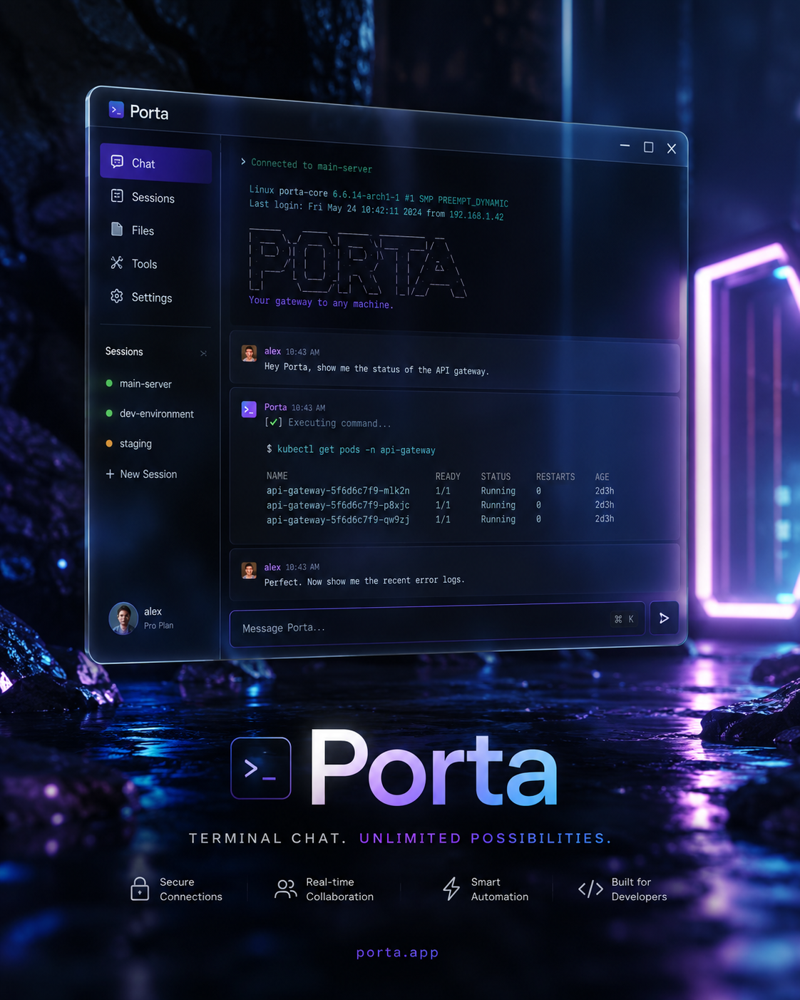

<p align="center">
  
  
  
  
</p>
<p align="center">
  
  
  
</p>

<p align="center">
  
</p>

<h1 align="center">⚡ Porta</h1>
<h3 align="center">A Real-Time Terminal Chat Application</h3>

<p align="center">
  
</p>

<p align="center">
  <em>Connect, chat, and collaborate securely from your terminal — powered by WebSockets and Textual.</em>
</p>

---

## 👤 Author

**Alireza Mosavi** — Solo Developer

> Porta was designed and implemented entirely by me to provide a robust, terminal-based messaging experience. 

---

## 📖 About

**Porta** is a lightweight, fully-featured terminal chat environment built on **Python**, featuring a beautiful TUI (Terminal User Interface) driven by **Textual**. It relies on an asynchronous **WebSockets** backend to ensure real-time communication between multiple clients.

It isn't just a basic script; it's a fully functional messaging system with persistent chat history, local databases, and the ability to tunnel connections over the public internet seamlessly.

- A stunning, reactive Terminal User Interface (Textual).
- Real-time asynchronous communication (websockets).
- Built-in secure public internet tunnel via `localhost.run`.
- Local SQLite database engine for persisting users and messages.
- Clean architecture with a separated client and server codebase.

No complex setups—just a pure native terminal experience for **macOS, Windows, and Linux**.

---

## ✨ Features at a Glance

| Feature | Description |
|---------|-------------|
| ⚡ **Real-Time Engine** | Asynchronous message routing handled securely via WebSockets |
| 🧩 **Rich TUI** | A full terminal user interface powered by Textual with inputs, logs, and scrolling |
| 🌍 **Public Tunnels** | Option to expose your local server securely over the public internet via SSH tunnel |
| 💾 **Database Backed** | All user accounts and message histories are saved to a local SQLite database |
| 🛡️ **Self-Hosted** | Your data stays on your machine. You host the server, you own the logs |
| 🚀 **Zero Config** | Starts instantly with minimal dependencies and an intuitive onboarding flow |

---

## 🧰 Tech Stack

| Component | Technology |
|-----------|-----------|
| Backend Engine | Python 3.11+ `websockets` + `asyncio` |
| UI Framework | Textual (TUI for Python) |
| Database | SQLite (`sqlite3`) |
| Public Tunnels | Localhost.run (via subprocess SSH) |

---

## 📂 Project Structure

```
LOCALCHAT/
├── db/                       # Local database storage
│   └── porta.db              # SQLite Database
├── server/                   # Server codebase
│   └── server.py             # WebSocket server & DB initialization
├── client/                   # Client codebase
│   └── client.py             # Textual TUI & WebSocket client
├── tests/                    # Automated testing suite
│   └── test_suite.py         # Full stack integration tests
├── .venv/                    # Python virtual environment
├── README.md                 # Project documentation
└── requirements.txt          # Python dependencies
```

---

## 🚀 Getting Started

### Prerequisites
- **Python 3.11+** installed

### Setup Environment
```bash
# Clone the repository
# Create a virtual environment
python -m venv .venv
source .venv/bin/activate

# Install dependencies
pip install textual websockets
```

### Start the Server
```bash
python server/server.py
```
*You will be prompted if you want to enable a public internet tunnel.*

### Start the Client
```bash
python client/client.py
```
*Enter your username and the server's WebSocket URL to connect.*

---

## 📄 License

MIT License — see `LICENSE`.

---

<p align="center">
  <em>Built with ⚡, Textual, and Python.</em>
</p>